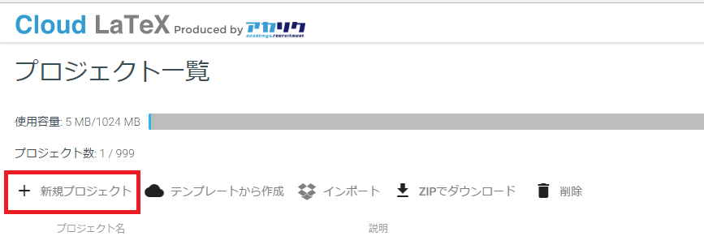
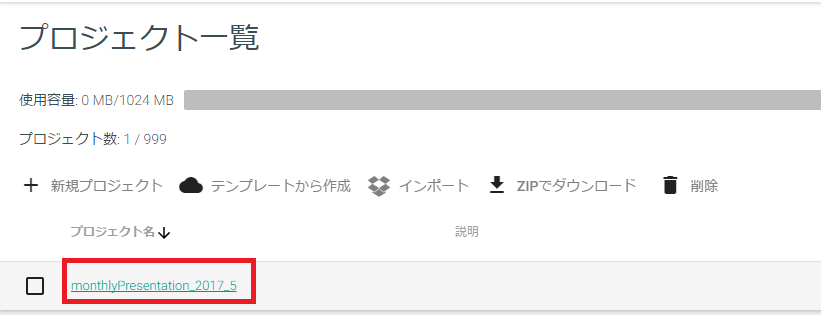
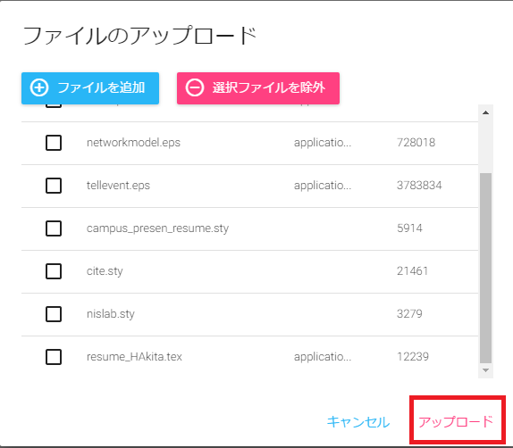
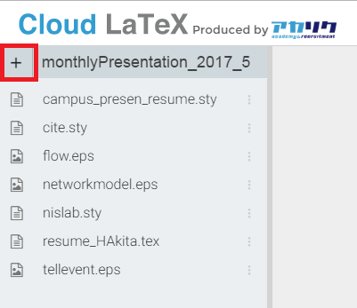
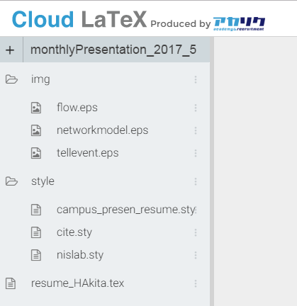
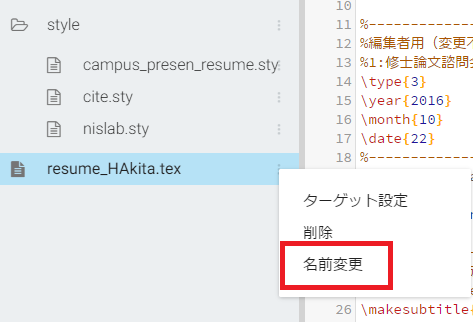
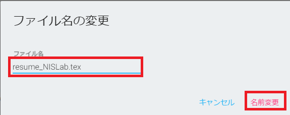
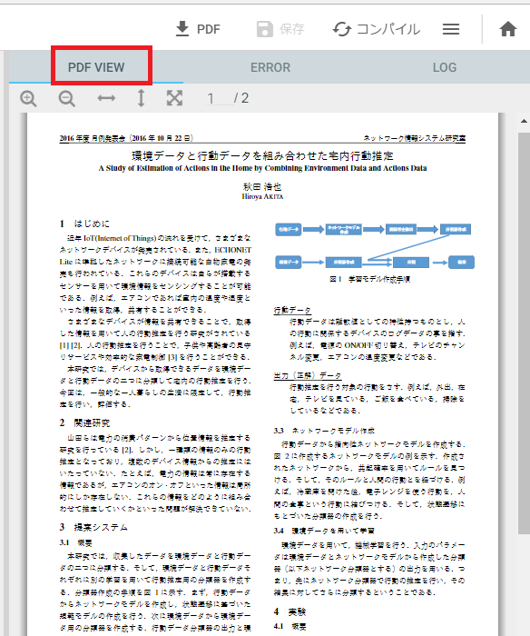
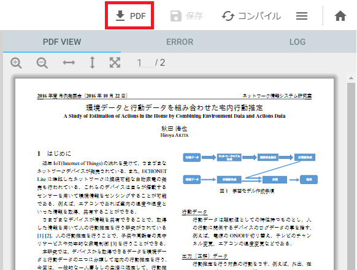

Cloud LaTex を利用します  
[Cloud Latex サイト](https://www.google.com/url?q=https%3A%2F%2Fcloudlatex.io%2Fja&sa=D&sntz=1&usg=AFQjCNEZM4RtnMFAa2F90DCCe9-xWVmKHQ)

新規登録をしてください．

## 月例発表会の資料作成の手順

### 資料作成

1. 新規プロジェクトをクリック

   

2. プロジェクト名を入力して，右下の作成ボタンを押します

   

3. プロジェクト名をクリック

   

4. デフォルトで存在する main.tex を削除します．  
   右にある点々をクリックして，「削除」を押します

   

5. main.tex を削除します

   

6. 必要なファイルをすべてアップロードします．  
   このサイトの一番下から monthlyPresentation_2017_4.zip をダウンロードして，解凍してください．  
   中身をすべて選択して，Cloud Latex にドラッグ&ドロップしてください．  
   すると以下の画面がでると思います．  
   右下のアップロードを押してください．

   

7. 「img」フォルダーと「style」フォルダーの追加を行います．  
   左上のプラスボタンを押してください．

   

8. 「新規フォルダ」をクリック

   

9. 「img」フォルダと「style」フォルダを作成してください．

   
   

10. img フォルダ内に「.eps」などの画像ファイルをドラッグ&ドロップします．  
    style フォルダ内に「.sty」のファイルをドラッグ&ドロップします．  
    最終的には以下のようになると思います．

    

11. resume_HAkita.tex の名前を変更します．  
    それぞれの名前を入力してください．

    
    

12. 「resume_NISLab.tex」をターゲットに設定します．

    

13. 右上にある「コンパイル」を押します．

    

14. PDF VIEW を押すと PDF が表示されていれば成功です．

    

### PDF ダウンロード

1. 以下のボタンを押せばダウンロードできます．

   

### プロジェクトのダウンロード

1. 右上のホームボタンを押します．

   

2. ダウンロードしたいプロジェクトにチェックをつけて「ZIP でダウンロード」ボタンを押します．  
   プロジェクトを ZIP でダウンロードできます．

   

### eps 画像作成方法

#### windows 版

[ベクタ画像作成.pptx を開く](https://docs.google.com/presentation/d/1ceRu6pQjv1g2i4fc5m-3yjh08gtNJtnZZZFxYg8K1BE/edit?usp=sharing)

#### Mac 版

##### 【方法 1】

Appstore で「スケッチ風ドロー」というアプリをインストールしてください．  
パワーポイントで，図を作成します．  
図をコピーして，「スケッチ風ドロー」に貼り付けます．  
「ファイル」→「書き出し」  
形式を eps で保存すれば，eps 画像ができます．

##### 参考リンク 1

<http://d.hatena.ne.jp/sxhxtxa/20090128/1233165255>

##### 【方法 2】

- 図の作成

  まず keynote か powerpoint で図を作ります。  
  「ファイル」→「プリント」  
  (「ページ属性」を「縦」にして、A4 の縦の印刷にします。)  
  左下の「PDF」を「Postscript として保存」に変更  
  名前の拡張子を「.ps」にして保存

- ghostscript&imagemagick をインストール

  ```sh
  brew install ghostscript
  brew install imagemagick
  ```

- ps2eps インストール

  ps2eps というソフトを brew でインストール

  ```sh
  brew install ps2eps
  ```

  Link のエラーが出る場合は、以下のページを参考にしてインストールしてください。  
  正直以下のコマンドを打てば OK です。

  ```sh
  brew link --overwrite ghostscript
  ```

  これでも無理な場合は、以下のコマンドを実行

  ```sh
  sudo chown -R ユーザ名:admin /usr/local/share/ghostscript
  ```

##### 参考リンク 2

[http://bakedmemo.blogspot.jp/2013/01/homebrewmaxtex.html](http://bakedmemo.blogspot.jp/)

- ps ファイルを eps ファイルに変換

  ```sh
  ps2eps sample.ps ←keynote で ps 画像を作成した場合
  ps2eps --rotate=+ sample.ps ←powerpoint で ps 画像を作成した場合
  ```

  で、ps ファイルを eps ファイルに変換できます。  
  この状態で、無駄な余白が削除された状態になります。

##### 参考リンク 3

[http://take-mmatthew.hatenablog.com/entry/2015/02/13/194737](http://take-mmatthew.hatenablog.com/)

## 添付ファイル

[monthlyPresentation_2017_5.zip](/content/guidance/tex-cloud/monthlyPresentation_2017_5.zip)
